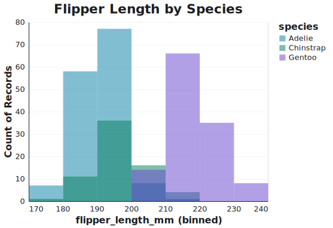
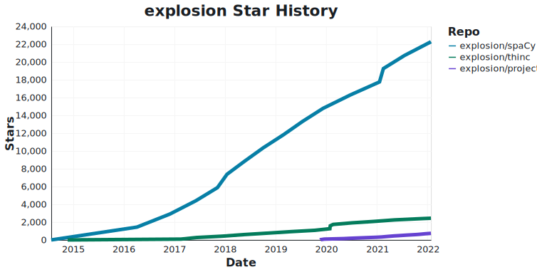
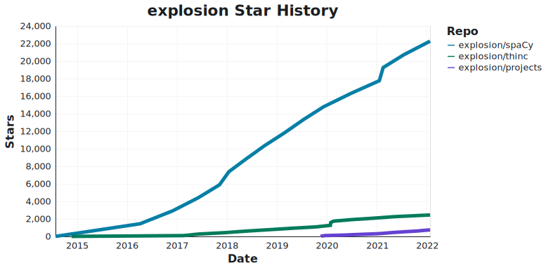
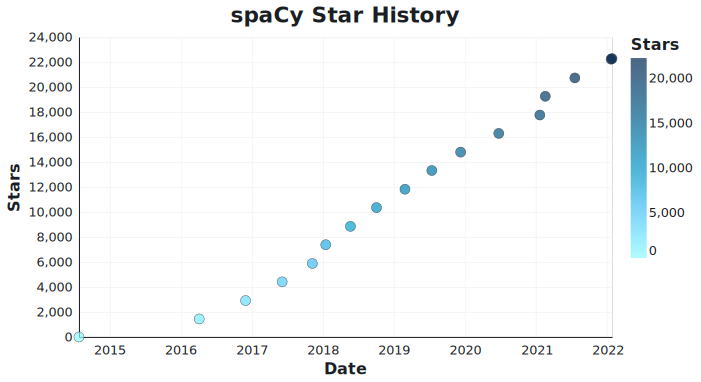

# spaCy Altair Theme

A theme for generating plots with Altair matching spaCy's branding.

**Note**: The `spacy-mono` theme uses [JetBrains Mono](https://www.jetbrains.com/lp/mono/), which is open source and free. You'll need to download it before local use.

## Install

```
pip install git+https://github.com/pmbaumgartner/spacy-altair-theme.git
```

## Use

```python
import altair as alt
import spacy_altair_theme
import pandas as pd

alt.themes.enable("spacy-mono")
# `spacy-base` theme also available to use the default font

df = pd.read_csv("https://raw.githubusercontent.com/mwaskom/seaborn-data/master/penguins.csv")

alt.Chart(df, title="Flipper Length by Species", width=400, height=300).mark_bar(
    opacity=0.5, binSpacing=0
).encode(
    alt.X("flipper_length_mm:Q", bin=alt.Bin(maxbins=10)),
    alt.Y("count()", stack=None),
    alt.Color("species:N"),
)
```



## Examples

Data from [star-history.com](https://star-history.com/).

Base Theme



Monospace Theme



Continuous Color Scale



## Notes

The default blue used in the theme is not the standard spaCy blue ([`#09a3d5`](https://webaim.org/resources/contrastchecker/?fcolor=09A3D5&bcolor=FFFFFF)), but the darker variant ([`#1f70b1`](https://webaim.org/resources/contrastchecker/?fcolor=1f70b1&bcolor=FFFFFF)). This is so the color exceeds a 3:1 contrast ratio following [WCAG AA guidelines](https://developer.mozilla.org/en-US/docs/Web/Accessibility/Understanding_WCAG/Perceivable/Color_contrast).
